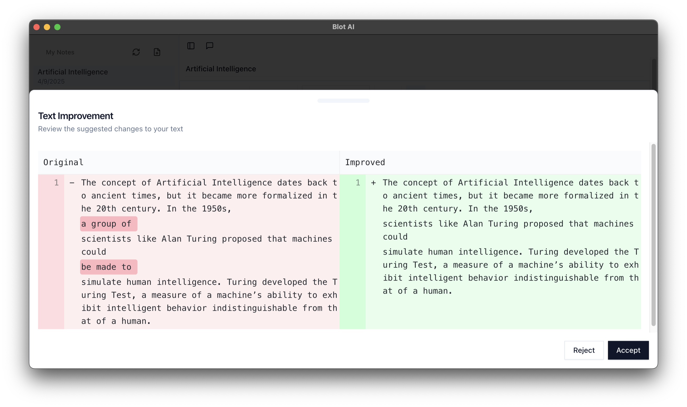
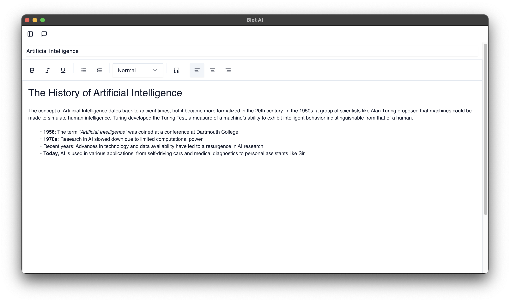
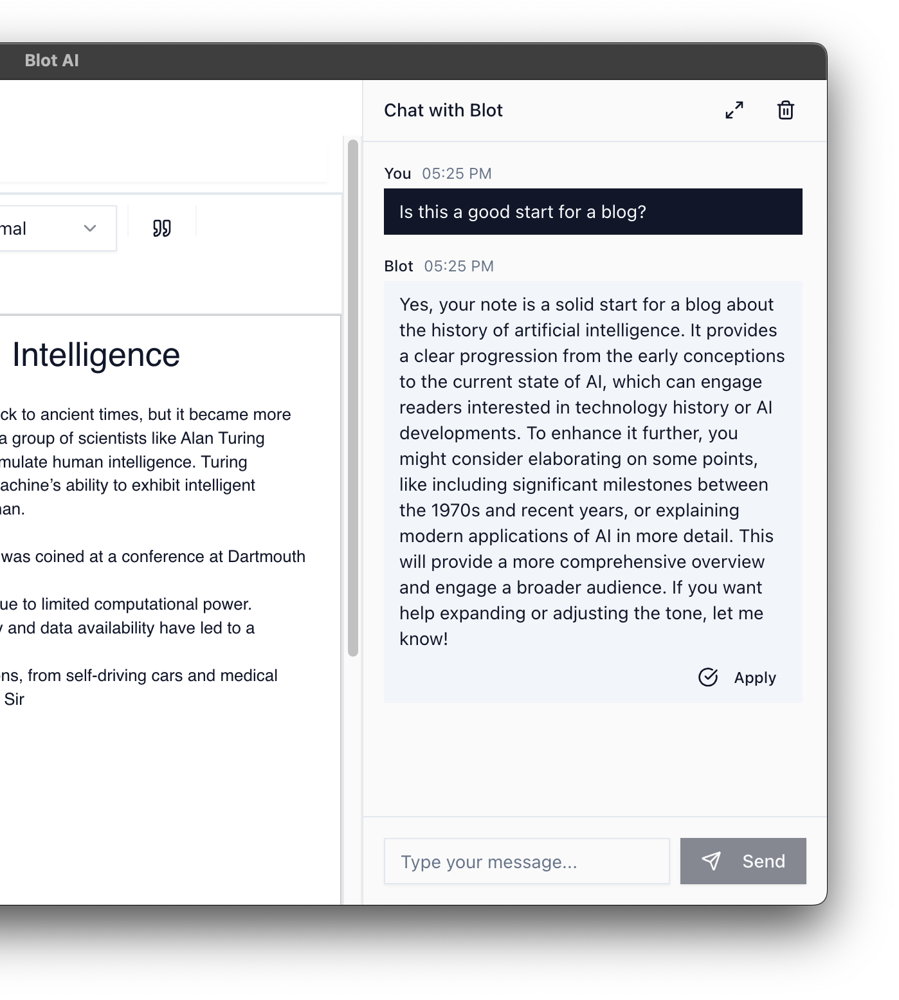
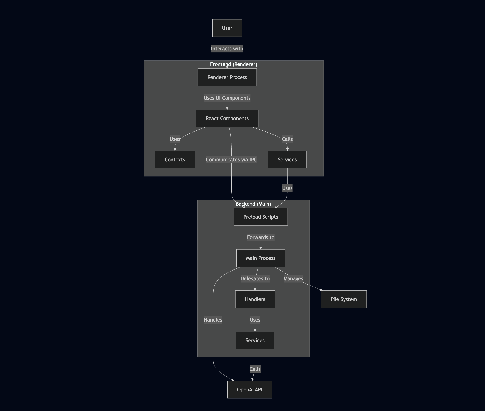

# Blot: AI-Assisted Writing


Blot is a minimalist electron app designed to enhance writing experiences.

Started because I wanted a "cursor for writing" tool for myself for small tasks like writing emails, notes, etc.

## Screenshots





## Current progress

This is a base version of Blot with core functionality implemented. It can serve as a foundation for anyone looking to build their own AI-assisted writing tool or adapt it for specific use cases. I'm actively working on improvements and refinements.

## Tech Stack

- **Electron**
- **React**
- **TypeScript**
- **Tailwind CSS**
- **Quill.js**
- **OpenAI API**
- **Shadcn/UI**
- **Langchain**

## Features

- **WYSIWYG Editor** - Distraction-free, minimalist writing environment
- **Context-Aware AI Chat** - Direct chat interaction within the editor for brainstorming and detailed suggestions
- **Visual Change Visualization** - Diff-view comparisons for AI-generated text suggestions
- **Inline Text Improvement** - Select text and get AI-powered improvement suggestions

### TODO

- **Real-Time AI Suggestions** - Contextually relevant recommendations as you type

## Installation

### Prerequisites

- Node.js 18.x or higher
- pnpm (recommended) or npm

### Setup

1. Clone the repository:

   ```bash
   git clone https://github.com/yourusername/blot.git
   cd blot
   ```

2. Install dependencies:

   ```bash
   pnpm install
   ```

3. Create a `.env` file in the project root:

   ```
   RENDERER_VITE_OPENAI_API_KEY=your_openai_api_key
   ```

4. Start the development server:
   ```bash
   pnpm run dev
   ```

### Building for Production

Build for your current platform:

```bash
pnpm run build
```

Platform-specific builds:

```bash
pnpm run build:win    # Windows
pnpm run build:mac    # macOS
pnpm run build:linux  # Linux
```

## Project Structure

```
blot/
├── src/                 # Source code
│   ├── main/            # Electron main process
│   │   ├── handlers/    # IPC handlers
│   │   ├── services/    # Main process services
│   │   ├── utils/       # Utility functions
│   │   └── index.ts     # Main entry point
│   ├── preload/         # Preload scripts for IPC
│   └── renderer/        # Renderer process (React)
│       ├── src/
│       │   ├── components/  # React components
│       │   ├── contexts/    # React contexts
│       │   ├── lib/         # Utility libraries
│       │   ├── services/    # Frontend services
│       │   ├── views/       # Page views
│       │   └── App.tsx      # Main React component
│       └── index.html       # HTML entry point
├── resources/           # Application resources
├── electron-builder.yml # Electron build configuration
└── package.json         # Project configuration
```

## Architecture



## Contributing

Contributions are welcome!

### Code Style

- Follow the existing code style
- Use TypeScript strictly typed where possible
- Write meaningful commit messages

### Component Structure

- UI components should be placed in `src/renderer/src/components/ui`
- Feature components should be placed in `src/renderer/src/components`
- Use contexts for state management across components

### Adding New Features

When adding new features to Blot, consider:

1. User experience and integration with existing workflow
2. Performance impact, especially for real-time features
3. AI implementation details and API usage efficiency
4. Privacy and security considerations

## License

[MIT](LICENSE)

## Acknowledgements

- [Electron](https://www.electronjs.org/)
- [React](https://reactjs.org/)
- [OpenAI](https://openai.com/)
- [Quill](https://quilljs.com/)
- [Shadcn/UI](https://ui.shadcn.com/)
